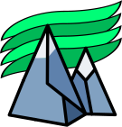

  

<h1 align="center">
  <a href="https://davidsanluisaguirre.com">Portafolio de David San Luis Aguirre</a>
</h1>

  <strong>Astro Blog</strong> – Un blog creado con Astro

## Stack

- **Language**: TypeScript
- **Framework**: [Astro](https://astro.build/)
- **Styling**: [TailwindCSS](https://tailwindcss.com/)
- **Font**: [IBM Plex Sans](https://fonts.google.com/specimen/IBM+Plex+Sans)
- **Icons**: [Tabler Icons](https://tabler.io/icons)
